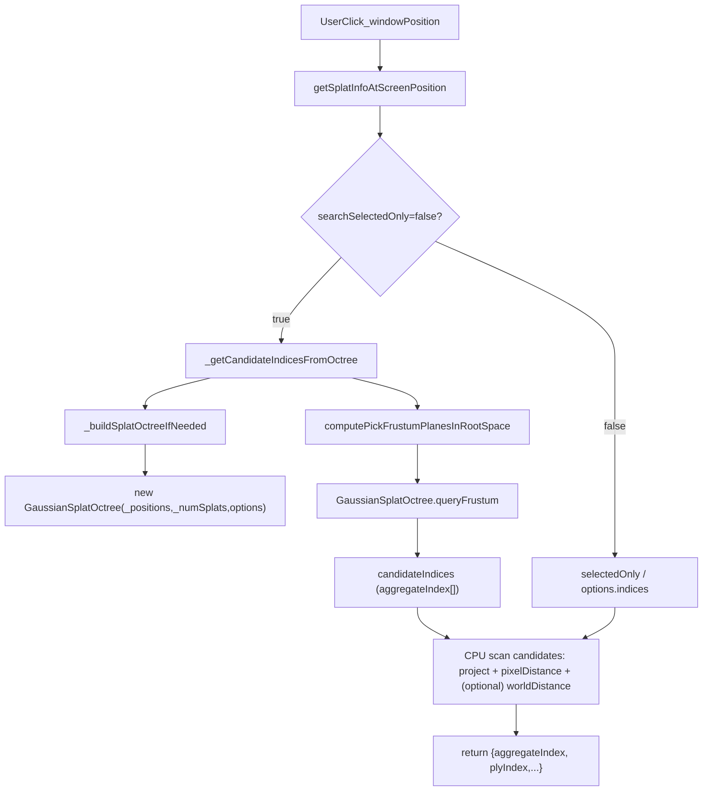
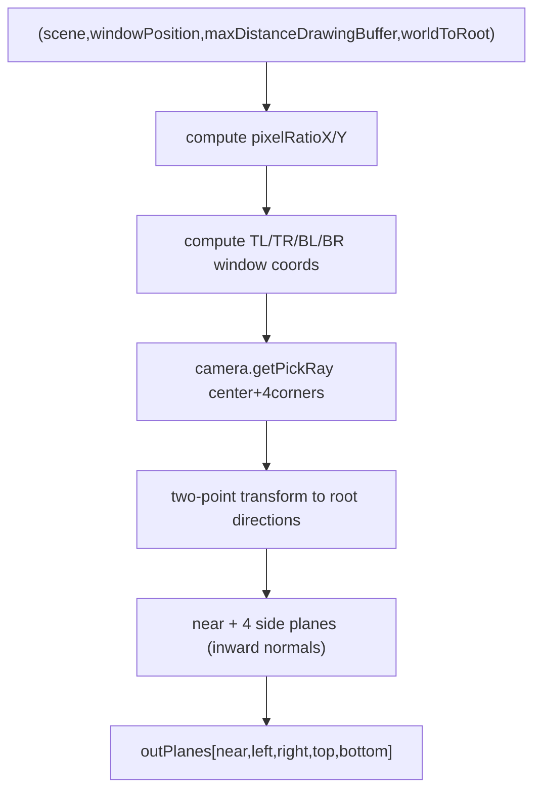

# 高斯瓦片点击全量查找八叉树流程（函数级）

本文档描述 **B1 八叉树（Octree）优化** 在 Cesium Gaussian Splat 的“全量拾取”链路中的代码流程：当 `searchSelectedOnly=false` 时，如何用 Octree **先裁剪候选 aggregateIndex**，再交给 `getSplatInfoAtScreenPosition` 的 CPU 逻辑做最终判定。

覆盖文件：
- `packages/engine/Source/Scene/GaussianSplatPrimitive.js`
- `packages/engine/Source/Scene/GaussianSplatOctree.js`

> 说明：
> - Octree 的职责是 **候选集剪枝（candidate pruning）**，并不直接返回最终 index。
> - 本方案不包含 GPU picking（PICK_PASS）链路；Octree 只服务于 CPU 扫描路径里“候选集太大导致卡顿”的问题。

## 术语与关键数据结构

- **root space**：`_positions` 存储的坐标空间（相对 `_rootTransform`）。
- **world space**：Cesium 世界坐标（ECEF），用于投影到屏幕与距离计算。
- **aggregateIndex**：当前参与渲染的 splat 连续索引（范围 `0.._numSplats-1`）。
- **Octree（八叉树）**：基于 root space 的 positions 构建，用于空间裁剪出“可能被点击”的 aggregateIndex 列表。

`GaussianSplatPrimitive` 上与 Octree 相关字段：
- `_splatOctree: GaussianSplatOctree | undefined`：八叉树实例
- `_splatOctreeDirty: boolean`：是否需要重建
- `_splatOctreeOptions`：
  - `leafCapacity`：叶子最多点数（默认 2048）
  - `maxDepth`：最大深度（默认 12）
  - `maxCandidates`：查询最大输出候选数（默认 200000，达到后 early-out）

## 函数级流程总览（从点击到候选集）

关键结论：
- **Octree 只影响 `candidateIndices` 的生成**（把 N 级全量缩到 M 级候选）。
- 最终返回的 index 仍由 `getSplatInfoAtScreenPosition` 的扫描逻辑决定。

---

## 1. `GaussianSplatPrimitive.js`：Octree 集成（函数级）

### 1.1 入口：`getSplatInfoAtScreenPosition(scene, windowPosition, options)`

Octree 仅在以下条件进入：
- `options.searchSelectedOnly === false`
- `_numSplats > 0`

进入后：
1. 计算一次 `rootToWorldMatrix = tileset.modelMatrix * _rootTransform`（后续 world↔root 变换与 CPU 扫描都复用）
2. 调用 `_getCandidateIndicesFromOctree(scene, windowPosition, maxDistance, rootToWorldMatrix)`
3. 若返回 `undefined` 或空数组：**回退全量** `Array.from({length:_numSplats},(_,i)=>i)`（保正确性）

> 设计点：Octree 查询失败不会影响功能正确性，但会退化回“卡顿的全量扫描”。

### 1.2 Octree 懒构建：`_buildSplatOctreeIfNeeded()`

职责：按需重建 `_splatOctree`。

函数行为：
- 若 `_splatOctreeDirty=false` 且 `_splatOctree` 已存在：直接返回（复用）
- 若 `_positions` 为空或 `_numSplats<=0`：调用 `destroySplatOctree(this)` 清理并返回
- 否则执行建树：
  - `this._splatOctree = new GaussianSplatOctree(this._positions, this._numSplats, this._splatOctreeOptions)`
  - `this._splatOctreeDirty = false`

### 1.3 候选查询：`_getCandidateIndicesFromOctree(scene, windowPosition, maxDistance, rootToWorldMatrix)`

职责：基于点击位置构造一个“拾取视锥（平面集合）”，在 root space 里查询可能命中的 aggregateIndex。

步骤：
1. 校验 `scene/camera`
2. 调用 `_buildSplatOctreeIfNeeded()` 确保 `_splatOctree` 已存在
3. 计算 `worldToRootMatrix = inverse(rootToWorldMatrix)`
4. 生成 5 个平面（root space）：
   - `computePickFrustumPlanesInRootSpace(scene, windowPosition, maxDistance, worldToRootMatrix, planes)`
5. 执行查询：
   - `scratchCandidateIndices.length = 0`
   - `this._splatOctree.queryFrustum(planes, scratchCandidateIndices, maxCandidates)`
6. 返回 `scratchCandidateIndices`（**aggregateIndex 列表**）

### 1.4 生命周期：何时销毁/标脏

#### 1.4.1 销毁函数：`destroySplatOctree(primitive)`

职责：释放树并标脏。

行为：
- 若 `_splatOctree.destroy()` 存在则调用
- `primitive._splatOctree = undefined`
- `primitive._splatOctreeDirty = true`

#### 1.4.2 `update(frameState)` 中的失效点

当 tileset 的选中 tile 数发生变化，positions/numSplats 将被重建。在重建前会：
- `destroySplatOctree(this)`（确保下次拾取会重新建树）

> 这一点很关键：Octree 的输入是 `_positions`。一旦 `_positions` 重建，旧 Octree 必须作废，否则会出现候选集错乱/越界。

---

## 2. 拾取视锥平面生成（函数级）

Octree 查询不是用“真实相机视锥”，而是构造了一个“围绕鼠标点击点的小视锥”：
- 以 `windowPosition` 为中心
- 以 `maxDistance`（drawingBuffer 像素半径）为边界
- 通过中心与四角的 5 条射线，生成 5 个半空间平面（near + 4 个侧面）
- **没有 far plane**（即前向无限长）

### 2.1 平面格式：`Cartesian4 (nx, ny, nz, d)`

代码采用的“inside”判定：
- 平面方程：\( n \cdot x + d = 0 \)
- 在平面“内侧”：\( n \cdot x + d \ge 0 \)

### 2.2 `setPlaneFromOriginAndNormal(outPlane, origin, normal)`

职责：把“过点 origin、法向 normal”的平面写入 `Cartesian4`。

核心：
- `d = -(n·origin)`

### 2.3 `computeSidePlane(outPlane, origin, dirA, dirB, dirCenter)`

职责：用两条边界方向 `dirA/dirB` 构造侧面平面，并确保法向指向“内侧”（包含中心方向 `dirCenter`）。

算法：
1. `normal = normalize(cross(dirA, dirB))`
2. 若 `dot(normal, dirCenter) < 0` 则 `normal = -normal`（翻转，使中心方向在内侧）
3. 调用 `setPlaneFromOriginAndNormal(outPlane, origin, normal)`

### 2.4 `computePickFrustumPlanesInRootSpace(scene, windowPosition, maxDistanceDrawingBuffer, worldToRootMatrix, outPlanes)`

职责：用“中心点 + 四角点”的 pick rays 生成 5 个平面（root space）。

步骤拆解：

#### (1) drawingBuffer 半径 → window 半径

`camera.getPickRay` 输入是 **window 像素坐标**。而拾取函数里 `maxDistance` 是 **drawingBuffer space** 的像素半径，因此先换算：
- `pixelRatioX = drawingBufferWidth / canvas.clientWidth`
- `pixelRatioY = drawingBufferHeight / canvas.clientHeight`
- `dxWindow = maxDistanceDrawingBuffer / pixelRatioX`
- `dyWindow = maxDistanceDrawingBuffer / pixelRatioY`

#### (2) 计算 5 条射线：中心 + 四角

角点 window 坐标：
- TL = `(x - dxWindow, y - dyWindow)`
- TR = `(x + dxWindow, y - dyWindow)`
- BR = `(x + dxWindow, y + dyWindow)`
- BL = `(x - dxWindow, y + dyWindow)`

然后：
- `rayCenter = camera.getPickRay(windowPosition)`
- `rayTL/TR/BR/BL = camera.getPickRay(corner)`

若任意 ray 为 `undefined`：返回 `false`（表示平面生成失败）。

#### (3) world→root：用“两点法”稳定变换 direction

把射线 origin 变到 root space 很直接：
- `originRoot = worldToRoot * originWorld`

direction 不能直接用 `Matrix4.multiplyByPoint`（会叠加平移），代码采用“两点法”：
- `endWorld = originWorld + directionWorld`
- `endRoot = worldToRoot * endWorld`
- `dirRoot = normalize(endRoot - originRoot)`

中心方向与四角方向都用这个方法得到。

#### (4) 组装 5 个平面（near + 4 个侧面）

输出顺序固定为：
- `planes[0]`：near（过 originRoot，法向=中心方向 `dirCenterRoot`）
- `planes[1]`：left（由 TL/BL 与中心方向决定内侧）
- `planes[2]`：right（由 BR/TR 与中心方向决定内侧）
- `planes[3]`：top（由 TR/TL 与中心方向决定内侧）
- `planes[4]`：bottom（由 BL/BR 与中心方向决定内侧）

> 直观理解：这些平面在 root space 形成一个“朝前无限长的小棱台”，用于裁剪可能落在鼠标附近的点。

---

## 3. `GaussianSplatOctree.js`：Octree 内部实现（函数级）

### 3.1 `computeBounds(positions, count)`

职责：遍历 root space positions，计算全局 AABB：
- `minX/minY/minZ`
- `maxX/maxY/maxZ`

该 AABB 作为根节点包围盒。

### 3.2 节点结构：`GaussianSplatOctreeNode`

字段：
- `minX/minY/minZ/maxX/maxY/maxZ`：节点 AABB
- `depth`：深度
- `indices: Uint32Array | undefined`：叶子节点持有点索引；内部节点为 `undefined`
- `children: Array<GaussianSplatOctreeNode|undefined> | undefined`

叶子判定：
- `isLeaf === defined(this.indices)`

### 3.3 构造与建树：`new GaussianSplatOctree(positionsRootSpace, count, options)`

流程：
1. 保存输入与 options：
   - `_leafCapacity = options.leafCapacity ?? 2048`
   - `_maxDepth = options.maxDepth ?? 12`
2. `computeBounds` 得到根 AABB
3. 构造 `rootIndices = Uint32Array([0..count-1])`
4. 递归建树：`this._root = this._buildNode(bounds..., rootIndices, depth=0)`

### 3.4 递归：`_buildNode(min..., max..., indices, depth)`

停止条件（成为叶子）：
- `indices.length <= leafCapacity` 或 `depth >= maxDepth`

否则进行一次 8-way 切分：
1. 计算节点中心：
   - `cx=(minX+maxX)/2`，`cy`，`cz`
2. 对每个点按八象限分桶：
   - `oct = (x>cx?1:0) | (y>cy?2:0) | (z>cz?4:0)`
3. 若切分退化（所有点落入同一个桶，`nonEmpty<=1`）：停止下切，返回叶子（避免无限递归/空分裂）
4. 否则创建内部节点，并为每个非空桶递归建子节点：
   - 子节点 AABB 由 `oct` 位决定使用 `[min,c]` 或 `[c,max]`
   - 桶内列表转 `Uint32Array`（紧凑存储）

### 3.5 AABB 与平面集合裁剪：`intersectsFrustumAabb(planes, aabb)`

职责：判断 AABB 是否与“平面半空间集合（frustum）”相交。

实现：经典的“positive vertex”测试（快速剔除）：
- 对每个平面，取 AABB 在法向方向上的最远点 `p`（positive vertex）
- 若 `n·p + d < 0`：整个 AABB 在平面外侧，可直接剔除
- 所有平面都不剔除 → 认为相交（继续下探）

### 3.6 查询：`queryFrustum(planes, outIndices, maxCandidates)`

职责：遍历 Octree，把与 frustum 相交的叶子节点内 indices 追加到 `outIndices`。

流程：
1. `maxCandidates = maxCandidates ?? 200000`
2. DFS（stack）遍历：
   - 弹出节点
   - 若 `!intersectsFrustumAabb(...)`：continue
   - 若 leaf：把 `indices` 全 push 到 `outIndices`
   - 若 internal：把 `children` push 入 stack
3. 若 `outIndices.length >= maxCandidates`：立即返回（early-out）

> 注意：`maxCandidates` early-out 会造成候选集“截断”，可能引入漏选/误选（因为最终 CPU 扫描只在候选集里选）。该参数通常用于保护极端情况下的性能上限。

---

## 4. 调试与常见问题（按代码分支）

### 4.1 `computePickFrustumPlanesInRootSpace` 返回 `false`

常见原因：
- `camera.getPickRay(...)` 返回 `undefined`（windowPosition 非法、camera 状态异常等）

表现：
- `_getCandidateIndicesFromOctree` 返回 `undefined`
- `getSplatInfoAtScreenPosition` 回退到全量扫描（可能卡顿）

### 4.2 候选数过大 / 达到 `maxCandidates`

表现：
- `candidateIndices.length` 很大，甚至触发 `maxCandidates` early-out
- CPU 扫描仍然可能卡顿（只是“没那么卡”）

建议：
- 收紧 `maxDistance`（点击半径越大，frustum 越大，候选越多）
- 调小 `leafCapacity` 或调大 `maxDepth`（更细分，裁剪更有效；但建树更重）
- 合理提升 `maxCandidates`（避免截断导致拾取不准；但候选过大又会增加扫描成本）

### 4.3 候选为空导致频繁回退全量

表现：
- `_getCandidateIndicesFromOctree` 返回空数组
- `getSplatInfoAtScreenPosition` 进入 fallback 全量

建议排查：
- `rootToWorldMatrix` 是否正确（`tileset.modelMatrix * _rootTransform`），尤其是 tileset/modelMatrix 未准备好时的分支
- `worldToRootMatrix = inverse(rootToWorldMatrix)` 是否可逆（极端情况下矩阵不可逆会导致方向异常）
- `maxDistance` 是否过小（frustum 太窄，命中概率下降）

### 4.4 “穿透”相关说明（Octree 视角）

Octree 只给候选集，不做遮挡/可见性判断：
- 同一像素附近的候选可能同时包含“前表面”和“背面”点
- 最终是否穿透取决于 `getSplatInfoAtScreenPosition` 的“最终挑选策略”

因此，如果出现“跟随但穿透”或“防穿透但不跟随”，应优先检查：
- 候选是否包含前表面点（若不包含，则只能选背面）
- 以及最终挑选策略在“像素距离 vs 深度”之间的权衡

